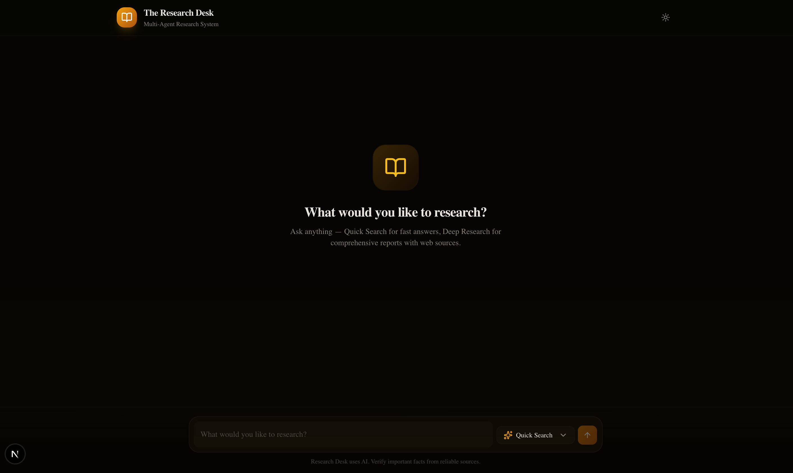
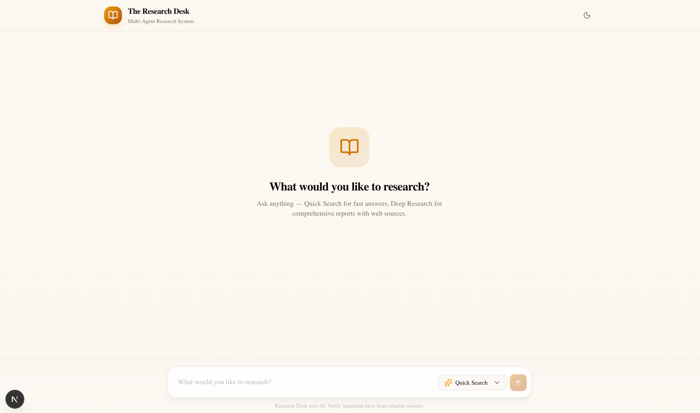
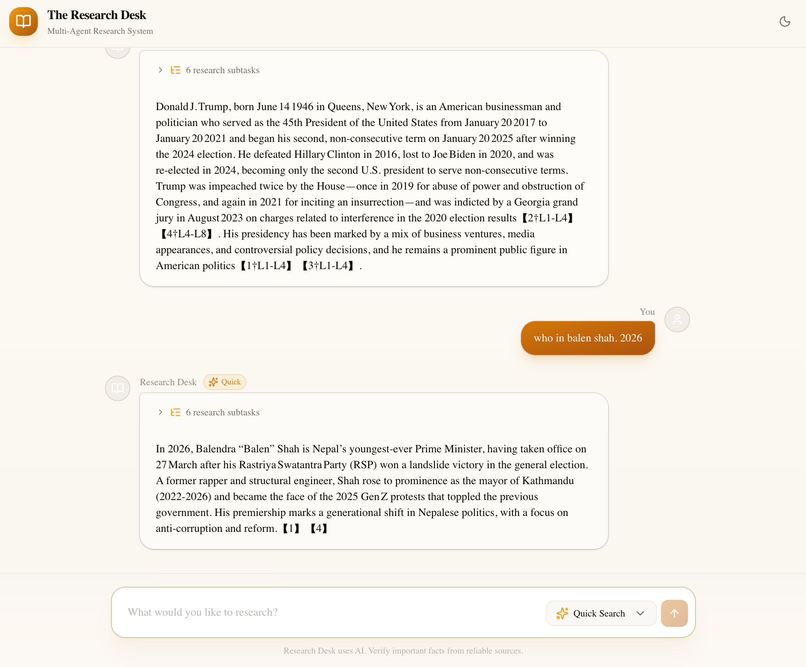

# The Research Desk

A multi-agent research system that orchestrates specialized AI agents to produce structured, fact-checked reports on any topic. Built with LangGraph for agent coordination, Tavily for live web search, and a Next.js chat interface with both Quick Search and Deep Research modes.

## How It Works

The system runs a pipeline of agents, each responsible for one stage of the research process:

1. **Orchestrator** — Analyzes the topic and breaks it down into focused subtasks
2. **Researcher** — Searches the web via Tavily, scrapes content from live sources
3. **Analyst** — Reads raw source material and extracts structured insights, dates, and quotes
4. **Writer** — Compiles insights into a formatted Markdown report
5. **Fact‑Checker** — Verifies every claim against the original sources

Each agent communicates through a shared LangGraph state. Quick Search skips the analysis pipeline and runs a single search-to-summary pass for faster answers.

## Screenshots


*Dark mode interface*


*Light mode interface*


*Research output example*

## Project Structure

```
├── app/                          # Backend (FastAPI + LangGraph)
│   ├── agents/
│   │   ├── orchestrator.py       # Topic breakdown & simple-query detection
│   │   ├── researcher.py         # Web search & content scraping
│   │   ├── analyst.py            # Structured insight extraction
│   │   ├── writer.py             # Report compilation
│   │   └── fact_checker.py       # Claim verification against sources
│   ├── tools/
│   │   ├── web_search.py         # Tavily (primary) + DuckDuckGo fallback
│   │   └── scraper.py            # HTML content extraction
│   ├── graph.py                  # LangGraph StateGraph wiring
│   ├── llm.py                    # Cloudflare Workers AI client
│   ├── state.py                  # AppState TypedDict
│   └── main.py                   # FastAPI app, polling & cancel endpoints
│
├── frontend/                     # Next.js App Router + shadcn/ui
│   └── src/
│       ├── app/
│       │   ├── page.tsx          # Chat page with auto-scroll & polling
│       │   ├── layout.tsx        # Root layout with ThemeProvider
│       │   └── globals.css       # Dark-first amber design system
│       ├── components/
│       │   ├── chat-input.tsx     # Textarea + mode selector + send/stop
│       │   ├── chat-message.tsx   # Message bubble with subtasks & fact-checks
│       │   ├── researching-indicator.tsx  # Animated loading dots
│       │   └── theme-toggle.tsx   # Dark/light mode switch
│       └── lib/
│           ├── api.ts            # startResearch, pollResearch, stopResearch
│           └── types.ts          # Message, ResearchMode types
│
├── sample_pic/                   # Screenshots for README
└── requirements.txt              # Python dependencies
```

## Tech Stack

| Layer | Technology |
|---|---|
| Backend framework | FastAPI (Python) |
| Agent orchestration | LangGraph with MemorySaver |
| LLM | Cloudflare Workers AI (`@cf/openai/gpt-oss-20b`) |
| Web search | Tavily API + DuckDuckGo fallback |
| Frontend | Next.js 16 App Router |
| UI components | shadcn/ui (Radix + Tailwind CSS) |
| Dark mode | next-themes |
| Content extraction | BeautifulSoup + httpx |
